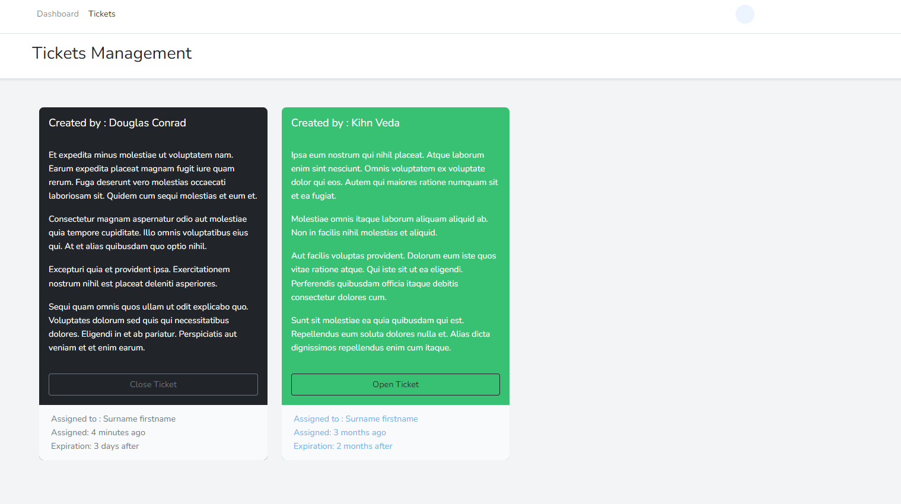

# Beschwerdemanagement

**Beschwerdemanagement mit Tickets**

*Aufgabenstellung:*

> Kunden (z.B. eines Telekommunikationsanbieters) können Beschwerden äußern, die anhand von drei Stichworten im System klassifiziert werden. Wenn zu diesen Stichworten keine Antworten auf die Beschwerden im System aufzufinden sind, wird automatisch ein sog. Ticket eröffnet.

> Ein Ticket steht eindeutig für ein gemeldetes Problem und enthält den Zeitpunkt der Eröffnung und wird einem Mitarbeiter aus dem Support zugewiesen. Anschließend wird durch diesen Mitarbeiter drei Tage lang versucht, eine Antwort zu finden und diese dann dem Kunden mitgeteilt.

> Wenn die Frist verstreicht, ohne das Ticket zu beantworten, wird dies bei dem Support-Mitarbeiter vermerkt. Wenn der Kunde mit der Antwort zufrieden ist, wird das Ticket geschlossen. Andernfalls wird das Ticket einem neuen Mitarbeiter zugeordnet und der Ablauf beginnt von Neuem.

## Übersicht
### Admin Dashboard

### User Management

### Ticket Management
#### Admin Übersicht

#### Mitarbeiter Übersicht

#### User Übersicht

## Welche Tools werden in diesem Projekt verwendet:

1. Frameworks:
    - Laravel 9.x
    - Bootstrap v5.0
    - JavaScript

2. Libraries:
   - Laravel fortify
   - Laravel JetStream
   - Laravel Charts
   - Laravel Livewire
   - Font Awesome

3. Programmiersprachen:
    - PHP 8.0
    - JavaScript

4. Datenbank und Server
    - Apache
    - MySQL

5. Projektplanung:
    - Visual Studio Paradigma

6. Projektmanagement:
    - GitHub
    - SourceTree

7. Entwicklungsumgebung
    - PhpStorm
    - Visual Studio Code

8. sonstiges:
    - HTML5
    - CSS

## Bereitstellung Schritte:

- see "doc/commands.txt"

## Beteiligten

### Team Mitglieder

- Omar Abdulkhalek
- Moritz Dathe
- Ümüt Yildiz

### Projekt Betreuer

- Herr Fethi Temiz

Studenten-Projekt im Rahmen des *Web-Entwicklung* Modules auf der **FHDW Mettmann**

**Studentenkurs: MFAX420A**
